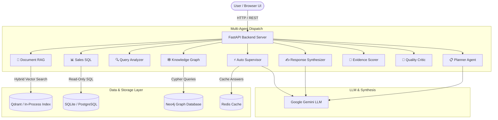

# RAGFlow Enterprise AI ⚡

> **Production-grade, Agentic RAG Platform with Grounded Multi-Source Intelligence**

RAGFlow Enterprise AI is an enterprise-oriented Agentic RAG platform. It combines vector retrieval, SQL database querying, knowledge graph exploration, and 9 specialized AI agents inside a unified, high-performance interface.

---

## 🌟 Key Features

- **🤖 9 Specialized AI Agents**:
  - **⚡ Auto Supervisor (`supervisor`)**: Multi-source orchestration pipeline.
  - **📋 Planner Agent (`planner`)**: Generates structured step-by-step action plans, timelines, and roadmaps from uploaded document evidence.
  - **🔍 Query Analyzer (`query_analyzer`)**: Classifies query intent, complexity, and target data sources.
  - **📄 Document RAG (`rag`)**: Hybrid BM25 + vector search over uploaded documents (`.pdf`, `.docx`, `.txt`, `.csv`, `.xlsx`, `.md`).
  - **📊 Sales SQL (`sql`)**: Translates natural language into safe, read-only SQL queries over relational databases.
  - **🕸️ Knowledge Graph (`graph`)**: Cypher graph exploration for organizational and manager relationships.
  - **🎯 Evidence Scorer (`evidence`)**: Ranks, scores, and audits retrieved context evidence.
  - **🔬 Quality Critic (`critic`)**: Evaluates retrieval precision, context relevance, and faithfulness.
  - **✍️ Response Synthesizer (`response`)**: Generates concise, cited markdown answers via LLM or smart fallback synthesis.

- **💬 Integrated Chat Agent Selector**:
  - Switch between all 9 agents right from the composer toolbar attached directly above the prompt box.
  - Instant confidence scores, citation chips, and execution latency for every message.

- **🔒 Enterprise Security & Auditability**:
  - JWT Bearer Authentication & Role-Based Access Control (Admin, Manager, Employee, Viewer).
  - Real-time prompt-injection guard screening incoming documents.
  - Comprehensive audit logging for all chat, search, document, and SQL operations.

- **🚀 Dual Mode Engine (Offline Fallback + Production LLM)**:
  - **LLM Engine**: Powered by Google Gemini (`gemini-2.5-flash` / `gemini-3.6-flash`).
  - **Deterministic Offline Engine**: Smart sentence-level keyword extraction and structured evidence synthesis when offline.

---

## 🏗️ Architecture Overview



---

## 🚀 Quick Start

### 1. Run with Docker Compose (Recommended)

```bash
# 1. Clone the repository
git clone https://github.com/your-username/RAGFlow_Enterprise_AI.git
cd RAGFlow_Enterprise_AI

# 2. Configure environment variables
copy .env.example .env

# 3. Launch all services
docker compose up --build
```

- **Frontend Workspace**: `http://localhost:5173`
- **Backend Swagger API Docs**: `http://localhost:8000/docs`
- **Prometheus Metrics**: `http://localhost:9090`
- **Grafana Dashboard**: `http://localhost:3000`

---

### 2. Manual Backend Setup (Local Development)

```bash
cd backend

# Create virtual environment
python -m venv .venv

# Activate virtual environment (Windows)
.venv\Scripts\activate
# (Linux/macOS: source .venv/bin/activate)

# Install dependencies
pip install -r requirements.txt

# Run backend dev server
uvicorn app.main:app --reload --port 8000
```

---

### 3. Manual Frontend Setup (Local Development)

```bash
cd frontend

# Install dependencies
npm install

# Run dev server
npm run dev
```

---

## ⚙️ Environment Variables

Create a `.env` file in the root directory (based on `.env.example`):

```ini
JWT_SECRET=change-me-before-deployment
DATABASE_URL=sqlite:///./ragflow.db
CORS_ORIGINS=http://localhost:5173,http://localhost
MAX_UPLOAD_BYTES=10485760

# Database & Cache URLs
POSTGRES_PASSWORD=ragflow_dev_password
REDIS_URL=redis://redis:6379/0
QDRANT_URL=http://qdrant:6333
NEO4J_URI=bolt://neo4j:7687
NEO4J_PASSWORD=ragflow_dev_password

# Gemini LLM Credentials
GEMINI_API_KEY=your_gemini_api_key_here
GEMINI_MODEL=gemini-2.5-flash
```

---

## 📡 API Reference

| Method | Endpoint | Description |
|---|---|---|
| `POST` | `/api/auth/register` | Register new user account |
| `POST` | `/api/auth/login` | Authenticate user & return JWT token |
| `GET` | `/api/documents` | List indexed documents for active user |
| `POST` | `/api/documents/upload` | Upload & index file (`.pdf`, `.docx`, `.txt`, `.csv`, `.xlsx`, `.md`) |
| `DELETE` | `/api/documents/{id}` | Remove document and index chunks |
| `POST` | `/api/chat` | Send chat query to selected agent (`agent_id`) |
| `GET` | `/api/agents` | List active agent statistics & run counts |
| `POST` | `/api/agents/{id}/invoke` | Directly invoke a specific agent |
| `POST` | `/api/sql/query` | Execute safe, read-only SQL queries |
| `GET` | `/api/analytics/overview` | Fetch workspace performance analytics |

---
